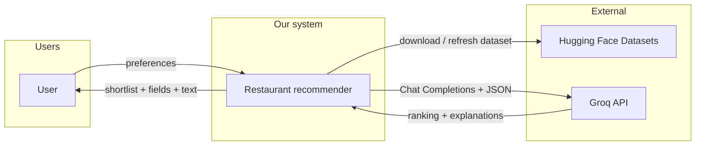
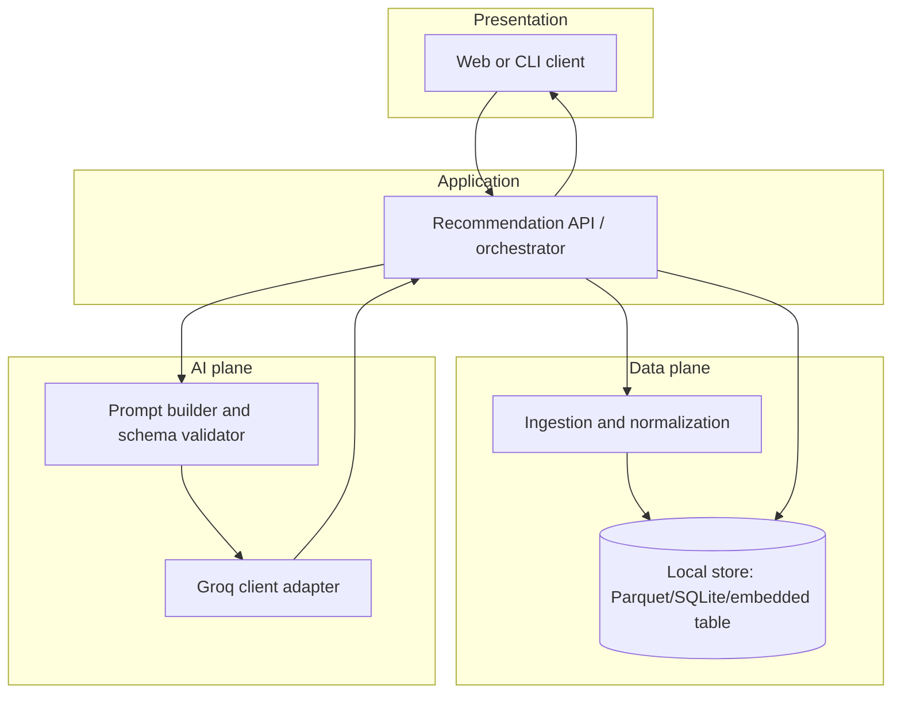
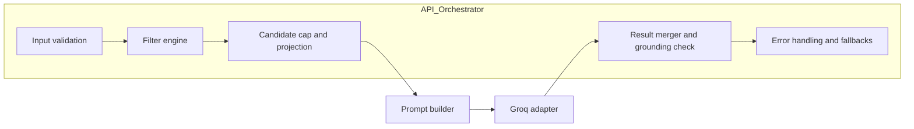
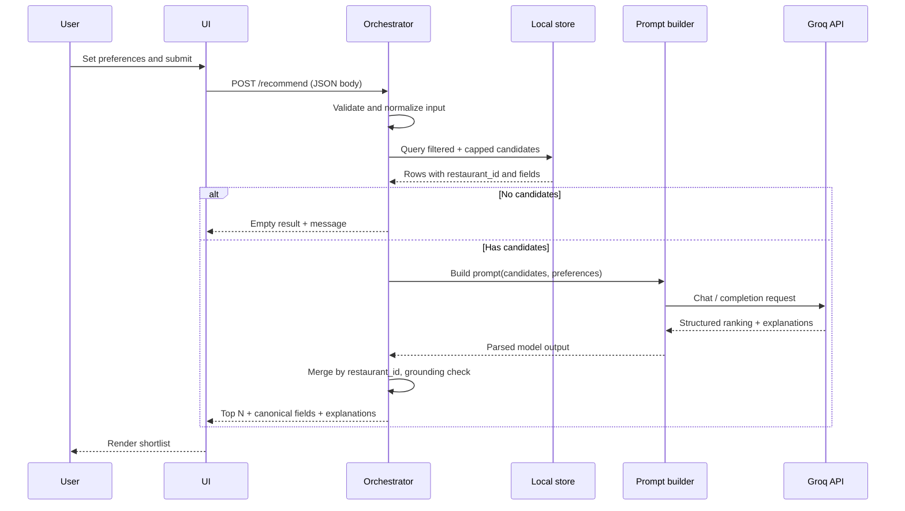
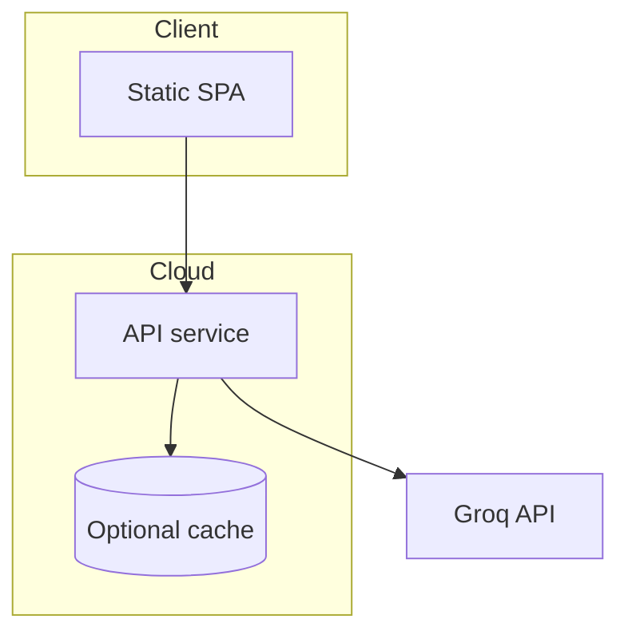

# System architecture

This document describes the **detailed architecture** for the AI-powered restaurant recommendation system defined in [problemStatement.md](./problemStatement.md). It translates goals there—**preferences → filtered data → LLM reasoning → grounded, explained results**—into components, contracts, and flows.

---

## 1. Goals that shape the architecture

| Goal (from problem statement) | Architectural implication |
|-------------------------------|---------------------------|
| Grounded recommendations (no invented venues) | Retrieval and filtering are **authoritative**; the LLM only reasons over **provided rows** (ideally keyed by stable IDs). |
| Personalized shortlist | **Structured filters** narrow the catalog; **LLM** ranks and explains within that set. |
| Clear UX | **API response** merges **canonical fields** from data with **LLM text**; UI stays thin. |
| Optional soft preferences (“family-friendly”, “quick meal”) | Pass soft preferences in prompt; keep **hard constraints** in the filter layer so the candidate set stays valid. |

**Design principle:** separate **deterministic retrieval** (filters, joins, caps) from **probabilistic generation** (ranking copy, explanations). The LLM does not replace the database; it interprets a bounded candidate list for the user.

---

## 2. High-level context (C4: System context)



**Actors**

- **User** supplies location, budget, cuisine, minimum rating, optional free-text preferences.
- **Hugging Face** supplies the source dataset ([ManikaSaini/zomato-restaurant-recommendation](https://huggingface.co/datasets/ManikaSaini/zomato-restaurant-recommendation)).
- **Groq** performs ranking and natural-language explanations **only** over the candidate payload sent in the prompt (see §7). Use a server-side **Groq API key**; the reference app uses Groq’s OpenAI-compatible **Chat Completions** API ([Groq API reference](https://console.groq.com/docs/api-reference#chat-create)).

---

## 3. Logical containers (major deployable / runnable parts)

These can map to one repo (monolith) or split services; the **logical** boundaries stay the same.



| Container | Responsibility |
|-----------|----------------|
| **UI** | Collect preferences; show top N with name, cuisine, rating, cost, explanation; handle loading and errors. |
| **Recommendation API / orchestrator** | Validate input; run filter query; cap candidates; call prompt builder + **Groq**; **merge** model output with store rows; enforce grounding rules. |
| **Ingestion and normalization** | Load HF dataset; map to canonical schema; clean types; dedupe if needed; persist for fast repeat queries. |
| **Local store** | Single source of truth for “what exists” between sessions (optional for demo: in-memory load each run). |
| **Prompt builder** | Assemble system + user messages; inject **only** allowed restaurant records (JSON or table); request structured output shape. |
| **Groq client adapter** | Groq SDK: Chat Completions, `response_format` JSON where supported; timeouts; parse JSON; map errors to deterministic fallback (§7.5). |

---

## 4. Component view (inside the orchestrator)



- **Input validation:** Reject unknown locations or impossible ranges; normalize budget bands and rating floors.
- **Filter engine:** SQL or dataframe-style predicates on canonical columns (location, cuisine, cost band, rating ≥ threshold).
- **Candidate cap:** Limit rows sent to **Groq** (for example 15–40) to control cost and latency; deterministic **pre-sort** (e.g. by rating, then cost) optional.
- **Result merger:** Map model-returned IDs or names back to store rows; drop unknown IDs; fill display fields from the store, not from the model.
- **Grounding check:** If the model references a restaurant not in the candidate list, discard or replace that line item (policy: strict drop vs retry with stricter prompt).

---

## 5. Canonical data model (conceptual)

Align fields with the problem statement (“name, location, cuisine, cost, rating”). Exact HF column names may differ; **ingestion** maps them here.

| Concept | Purpose | Notes |
|---------|---------|--------|
| `restaurant_id` | Stable join key between LLM output and store | Prefer dataset ID or hash of (name, location) if no ID exists. |
| `name`, `location`, `cuisine` | Filter + display | Normalize location and cuisine strings (trim, case). |
| `cost` or `cost_band` | Filter + display | Map raw values to low / medium / high if the UI uses bands. |
| `rating` | Filter + display | Numeric; enforce minimum in filter, not only in prompt. |
| `raw_row` or extra attributes | Optional context for LLM | Only if useful; keep prompt small. |

**Ingestion pipeline (batch or on startup):**

1. Fetch dataset from Hugging Face.
2. Select and rename columns to the canonical model.
3. Type coercion and null handling (drop or impute with explicit rules).
4. Persist to local store and optionally build indexes (location, cuisine) for fast filtering.

---

## 6. End-to-end sequence: one recommendation request



---

## 7. LLM integration design

### 7.1 Roles

- **System message:** Instructs the model to only rank and explain restaurants **from the provided list**; forbid inventing new venues; prefer concise explanations tied to user preferences.
- **User message:** JSON or markdown table of candidates (each with `restaurant_id`) plus user preferences including optional free-text.

### 7.2 Requested output shape (machine-readable + display)

Ask the model for **structured output** (JSON schema or tool calling) such as:

```json
{
  "ranked_ids": ["id_3", "id_1", "id_7"],
  "items": [
    {
      "restaurant_id": "id_3",
      "explanation": "Short paragraph tied to stated preferences."
    }
  ]
}
```

The **orchestrator** then:

1. Sorts and slices by `ranked_ids` (or uses `items` order).
2. Joins each `restaurant_id` to the store for **name, cuisine, rating, cost**.
3. Discards any ID not in the original candidate set.

### 7.3 Groq-specific notes

- **Authentication:** `GROQ_API_KEY` (server env only). The Python app uses the official **`groq`** client with `chat.completions.create`.
- **Models:** Configurable via `GROQ_MODEL` (default in code: a current Groq-hosted Llama variant). Pick a model that supports **`response_format: { "type": "json_object" }`** for structured ranking output.
- **Latency:** Groq is optimized for fast inference; the orchestrator still caps candidate count before the call to control tokens and cost (§7.4).

### 7.4 Grounding and safety

- **Never** ask the model to recall restaurants from its training data for this use case; only from the injected list.
- **Cap** candidates and **truncate** long text fields in the prompt to respect token limits.
- **Retry policy:** On invalid JSON or hallucinated IDs, optionally one retry with a shorter list or stricter system prompt; otherwise return deterministic top-K by rating from filtered set with a generic message.

---

## 8. API contract (illustrative)

**Request** `POST /recommend` (or equivalent RPC):

```json
{
  "location": "Delhi",
  "budget": "medium",
  "cuisine": "Chinese",
  "min_rating": 4.0,
  "notes": "quick lunch, near office",
  "top_n": 5
}
```

**Response:**

```json
{
  "results": [
    {
      "restaurant_id": "…",
      "name": "…",
      "cuisine": "…",
      "rating": 4.2,
      "cost_band": "medium",
      "explanation": "…"
    }
  ],
  "meta": {
    "candidate_count": 28,
    "model": "…"
  }
}
```

Field names are illustrative; keep them consistent between UI, API, and prompt builder.

---

## 9. Cross-cutting concerns

| Concern | Approach |
|---------|----------|
| **Secrets** | **Groq** (`GROQ_API_KEY`), HF tokens (`HF_TOKEN`), and any other secrets only on the server or in local env; never ship to a public client in production demos. |
| **Latency** | Pre-materialized store; bounded candidate count; streaming optional for UX. |
| **Observability** | Log request id, candidate count, latency, LLM errors (no PII in logs if notes contain personal detail). |
| **Testing** | Unit tests for filters and merger; contract tests for prompt JSON with a mocked LLM; golden-file tests for ingestion mapping. |
| **Cost control** | Cap list size, cache dataset, debounce UI if needed. |

---

## 10. Optional physical deployment views

**Local / demo (simplest):** single process runs ingestion once, serves API + static UI; LLM calls go out to provider.

**Split (portfolio):** static frontend on CDN; small backend on a PaaS; secrets in vault; dataset refreshed on schedule or on deploy.



---

## 11. Traceability to the problem statement

| Problem statement item | Architecture location |
|------------------------|------------------------|
| Load and clean dataset | §3 Ingestion, §5 Canonical model |
| Collect user preferences | §2 UI, §8 API |
| Filter restaurants | §4 Filter engine, §6 Sequence |
| Groq rank + explain | §7 |
| Display top picks with fields + explanation | §3 UI, §8 Response, §6 Merge step |

For **what** and **why** the product exists, see [problemStatement.md](./problemStatement.md). This file is the reference for **how** the system is structured to deliver that outcome. For **phased implementation** (foundation → data → API → LLM → UI → hardening), see [implementation-plan.md](./implementation-plan.md). For **edge cases and failure modes**, see [edgecase.md](./edgecase.md).
