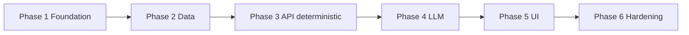

# Phase-wise implementation plan

This plan implements the product defined in [problemStatement.md](./problemStatement.md) using the structure in [architecture.md](./architecture.md). Each phase ends with **verifiable deliverables** so you can stop after any phase and still have a coherent increment.

---

## How to read this document

| Source | What it supplies for implementation |
|--------|-------------------------------------|
| [problemStatement.md](./problemStatement.md) | Success criteria, user inputs, outputs, scope (ingestion, filters, LLM, UI). |
| [architecture.md](./architecture.md) | Containers, orchestrator components, canonical model, API shape, LLM contract, grounding rules. |
| [edgecase.md](./edgecase.md) | Boundary conditions, failure modes, and a minimal test matrix aligned with both docs. |

**Recommended path:** complete phases **1 → 3** first for a **deterministic** pipeline (data + filters + API). Add **Phase 4** for LLM ranking and explanations. Add **Phase 5** for full UX. Use **Phase 6** before demos or production-like runs.

---

## Phase overview

| Phase | Focus | Primary outcome |
|-------|--------|-----------------|
| [1](#phase-1--project-foundation-and-contracts) | Foundation and contracts | Runnable skeleton, shared types, env pattern |
| [2](#phase-2--data-ingestion-and-local-store) | Ingestion and store | HF data loaded, canonical schema, persisted or in-memory store |
| [3](#phase-3--orchestrator-without-llm-deterministic-path) | Validation, filter, cap | `POST /recommend` returns top-K from store only (no LLM) |
| [4](#phase-4--llm-integration-prompt-merge-grounding) | Prompt builder + LLM adapter | Ranked IDs + explanations merged and grounded |
| [5](#phase-5--presentation-layer) | UI | Preferences form + shortlist with fields + explanation text |
| [6](#phase-6--hardening-observability-and-optional-deploy) | Quality and ops | Tests, logging, fallbacks, optional deploy |



---

## Phase 1 — Project foundation and contracts

**Intent (architecture):** Establish boundaries between UI, API, store, and LLM before filling logic. Align with API contract in architecture §8 and field names across layers.

**Tasks**

1. Choose runtime (for example Python + FastAPI, or Node + Express) and document it in the repo README when you add code.
2. Define **request/response types** matching architecture §8: `location`, `budget`, `cuisine`, `min_rating`, optional `notes`, `top_n`; response `results[]` with `restaurant_id`, `name`, `cuisine`, `rating`, `cost_band`, `explanation` (explanation may be empty until Phase 4).
3. Add **environment configuration** for HF token (if required), LLM API key, and model name; load from env only (architecture §9 secrets).
4. Create a **stub orchestrator** route `POST /recommend` that validates shape and returns empty `results` with `meta` placeholder.
5. Add a minimal **health** route (for deploy and smoke tests).

**Exit criteria**

- Project runs locally; `POST /recommend` accepts the agreed JSON body and returns valid JSON.
- No secrets in source control; `.env.example` (or equivalent) lists required variables without values.

**Traceability**

| Problem statement | Architecture |
|-------------------|--------------|
| Steps 2–5 deferred to later phases; foundation supports them | §3 containers, §8 API |

---

## Phase 2 — Data ingestion and local store

**Intent (problem statement):** “Loads and cleans the dataset.” **Intent (architecture):** Ingestion pipeline §5, canonical model, local store (Parquet/SQLite/in-memory).

**Tasks**

1. Integrate **Hugging Face** dataset load for [ManikaSaini/zomato-restaurant-recommendation](https://huggingface.co/datasets/ManikaSaini/zomato-restaurant-recommendation).
2. Inspect raw columns; write a **mapping** to canonical fields: `restaurant_id`, `name`, `location`, `cuisine`, `cost` or `cost_band`, `rating` (architecture §5).
3. Implement **normalization**: trim strings, consistent case for matching where needed, numeric `rating`, map raw cost to `low` / `medium` / `high` if the UI uses bands.
4. Handle **nulls and invalid rows** with explicit rules (drop or default); document them.
5. **Persist** to local store (recommended for repeat runs) or load into memory on startup; optional CLI/script: `ingest` vs `serve`.
6. Optionally build **indexes** on `location` and `cuisine` if the store supports it (architecture §5).

**Exit criteria**

- Row count and sample queries documented; at least one filter-by-location query works against the store.
- Stable `restaurant_id` for every row used downstream (architecture §5).

**Traceability**

| Problem statement | Architecture |
|-------------------|--------------|
| Step 1: load and clean | §3 Ingestion, §5 canonical model, §5 ingestion pipeline |

---

## Phase 3 — Orchestrator without LLM (deterministic path)

**Intent (problem statement):** Steps 2–3: collect preferences (via API for now) and **filter** to a relevant subset. **Intent (architecture):** Validation, filter engine, candidate cap, projection (§4); empty-candidate branch (§6).

**Tasks**

1. **Input validation:** Normalize `budget` and `min_rating`; reject impossible values; optional allow-list or fuzzy match for `location` / `cuisine` (document behavior for unknown values).
2. **Filter engine:** Hard constraints on location, cuisine, cost band, `rating >= min_rating` (architecture §4: hard constraints in filter, not only in prompt).
3. **Candidate cap:** Limit to a fixed max (for example 20–40) with deterministic **pre-sort** (for example rating desc, then cost) before any LLM work (architecture §4, §7.3).
4. **Projection:** Return top `top_n` rows from the capped list with **all display fields from the store**; set `explanation` to a fixed string such as “Ranked by rating and cost (LLM not enabled)” or leave empty behind a feature flag.
5. **Empty set:** Return `results: []` and a clear `meta.message` when no rows match (architecture §6).

**Exit criteria**

- With LLM disabled or skipped, the API returns a correct, reproducible shortlist for known preference combinations.
- Unit tests for filters and edge cases (no matches, boundary ratings).

**Traceability**

| Problem statement | Architecture |
|-------------------|--------------|
| Steps 2–3; display fields without AI text yet | §4 VAL, FIL, CAP; §6 alt “No candidates” |

---

## Phase 4 — LLM integration (prompt, merge, grounding) — **Groq**

**Intent (problem statement):** Step 4: LLM ranks and explains; success: **grounded**, personalized, understandable. **Intent (architecture):** §7 LLM design, §4 merge and grounding, §7.3 retries/fallback.

**Provider:** **[Groq](https://groq.com/)** Chat Completions (`GROQ_API_KEY`, `GROQ_MODEL`); OpenAI-compatible API. See [architecture.md](./architecture.md) §7.3–7.4.

**Tasks**

1. **Prompt builder:** System message: only use provided list; no invented venues; concise explanations tied to preferences including optional `notes` (architecture §7.1).
2. **User payload:** Structured list of candidates with `restaurant_id` and minimal fields for reasoning; include user preferences JSON (architecture §7.1).
3. **Structured output:** Request JSON (or tool/schema) matching architecture §7.2: `ranked_ids` and/or `items[]` with `restaurant_id` + `explanation`.
4. **LLM adapter:** Provider SDK or HTTP; timeouts; token budget; parse JSON; handle malformed responses (architecture §3 LLM container, §9).
5. **Merger:** Join model output to store by `restaurant_id`; **display fields always from store**, not from model (architecture §4, §7.2 step 2).
6. **Grounding check:** Drop unknown IDs; optional single **retry** with stricter prompt or shorter list (architecture §7.3).
7. **Fallback:** If LLM fails or all IDs invalid, return deterministic top-K from Phase 3 with a short `meta` notice (architecture §7.3).

**Exit criteria**

- End-to-end: preferences → filtered candidates → LLM → merged response with explanations.
- Manual or automated check: model cannot introduce a `restaurant_id` not present in the candidate batch.

**Traceability**

| Problem statement | Architecture |
|-------------------|--------------|
| Step 4; grounding success criteria | §7, §4 MERGE, grounding; §6 happy path |

---

## Phase 5 — Presentation layer

**Intent (problem statement):** Step 5: “Displays” top picks with name, cuisine, rating, cost, AI explanation; easy to understand UI.

**Tasks**

1. Build **web or CLI** per architecture §3 (web preferred for demos): form fields for location, budget, cuisine, min rating, optional notes, top N.
2. Call `POST /recommend`; show **loading** and **error** states (network, validation, empty results).
3. Render **shortlist**: name, cuisine, rating, cost band, explanation; show `meta.candidate_count` if useful for transparency.
4. Keep **API keys on the server** in production-style setups; if SPA-only demo, use a minimal backend proxy (architecture §9, §10).

**Exit criteria**

- Non-developer can complete one session: enter preferences → see grounded shortlist with explanations.
- Matches problem statement output expectations.

**Traceability**

| Problem statement | Architecture |
|-------------------|--------------|
| Step 5; “easy to understand” | §3 UI; §6 UI render; §8 response |

---

## Phase 6 — Hardening, observability, and optional deploy

**Intent (architecture):** §9 cross-cutting; optional §10 deployment.

**Tasks**

1. **Tests:** Unit tests for ingestion mapping; filter engine; JSON parse and merger with **mocked LLM**; golden fixtures for a small CSV slice if HF is slow in CI.
2. **Observability:** Request id, candidate count, latency, LLM errors; avoid logging raw `notes` if it may contain PII (architecture §9).
3. **Cost and latency:** Confirm cap and prompt size; optional debounce on UI (architecture §9).
4. **README:** How to ingest, run API, run UI, required env vars, example curl.
5. **Optional:** Containerize API; static FE on CDN; document refresh policy for dataset (architecture §10).

**Exit criteria**

- CI or documented test command passes; README sufficient for a new machine.
- Demo checklist: cold start → ingest → recommend → UI.

**Traceability**

| Problem statement | Architecture |
|-------------------|--------------|
| Reliability around success criteria | §9; §10 optional |

---

## Dependency summary

```text
Phase 1 (contracts, stub API)
    └── Phase 2 (ingestion + store) — needs HF access and schema decisions
            └── Phase 3 (filters + deterministic recommend)
                    └── Phase 4 (LLM) — needs provider key and prompt tuning
                            └── Phase 5 (UI) — needs stable API
                                    └── Phase 6 (hardening)
```

Phases **2** and **3** can overlap slightly (ingestion script + filter module in parallel) once `restaurant_id` and column names are fixed.

---

## Risk register (short)

See [edgecase.md](./edgecase.md) for a broader catalog of boundary conditions and suggested handling.

| Risk | Mitigation |
|------|------------|
| HF schema differs from assumptions | Phase 2: inspect dataset early; version the mapping; golden tests. |
| LLM returns invalid JSON | Phase 4: schema enforcement, retry, fallback to Phase 3 ordering. |
| Hallucinated restaurants | Phase 4: strict ID whitelist merge; drop unknown IDs. |
| Token limits | Phase 3 cap + Phase 4 truncate long fields in prompt (architecture §7.3). |

---

## Definition of done (full project)

Aligned with [problemStatement.md](./problemStatement.md):

1. Dataset loaded and cleaned with a documented canonical schema.
2. User preferences captured and used for **hard** filtering.
3. LLM ranks and explains **only** within the candidate set; responses merged and grounded.
4. UI (or documented CLI) shows top picks with name, cuisine, rating, cost, and explanation.
5. README and basic tests support review and rerun.

For system structure and diagrams, continue to use [architecture.md](./architecture.md).
